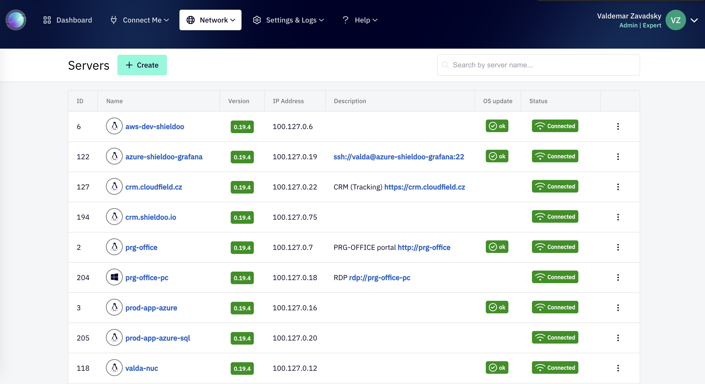

# Shieldoo Mesh Docker Compose Installation Guide

## What is Shieldoo Mesh?

Shieldoo Mesh is a network administration tool leveraging the power of open-source technology, Nebula. Developed at Slack by Nate Brown and Ryan Huber, Nebula has been proven to securely manage networks for millions of users around the globe. Shieldoo Mesh encapsulates the intricate network security in a simple, user-friendly application, allowing devices to connect securely with a few clicks, no matter where they are located.

See home page of our project: https://shieldoo.io

#### Shieldoo Admin portal screenshots

<p>
    
    &nbsp; &nbsp;
    
</p>

## Key Features

1. **Public IP Not Required**: Forget about the challenges of configuring a public IP. Shieldoo simplifies the process, making your network less vulnerable and more secure.
  
2. **Lighthouse Technology**: Our unique "lighthouse" system guides each node to its destination. As a node connects to your network, it communicates with the lighthouse, which directs your device to the server node using the established connection.
  
3. **Single Sign-On**: You can log into your secure network using Google or Microsoft accounts, simplifying the login process and improving the user experience.
  
4. **Zero Trust**: We've built Shieldoo based on the Zero Trust principle, which requires identity verification for all endpoints on the network and checks service access eligibility.
  
5. **Time-limited Access**: Shieldoo supports temporary access rights, enabling admins to control and monitor access to the network over specified time periods.
  
6. **Traffic Monitoring**: As an administrator, you can monitor which endpoint connects where and when, helping you track usage statistics and identify suspicious activity.
  
7. **Easy Management**: Shieldoo Mesh Admin makes network management a breeze, removing complexities like subnet and certificate hassles, and providing a user-friendly interface.
  
8. **Lightweight Operation**: Shieldoo Mesh Admin doesn't demand robust servers or extensive cloud capacity. Devices can communicate peer-to-peer, requiring minimal network backend interaction.

## Installation Guide

### Follow these steps to run Shieldoo Mesh on your infrastructure:

1. Create a server in the public cloud or your chosen location.
2. Install Docker on the server.
3. Obtain the public IP address of the server.
4. Enable ports 80/TCP, 443/TCP, 4242/UDP on your firewall.
5. Clone this repository using git.
6. Navigate into the cloned repository/server.
7. Update the .env file with the following essential information:
    - `ADMIN_EMAIL`: The email of the admin user.
    - `SHIELDOO_DOMAIN`: The domain name of Shieldoo Mesh (will be used for `admin.*`, `wss.*` and `login.*` subdomains). It means value `myshieldoo.example.com` will be used for `admin.myshieldoo.example.com`, `wss.myshieldoo.example.com` and `login.myshieldoo.example.com`.
    - LIGHTHOUSE_IP: The public IP address of the server.
    - `AAD_CLIENTID`: Your Azure AD client ID.
    - `AAD_CLIENTSECRET`: Your Azure AD client secret.
    - `AAD_TENANTID`: Your Azure AD tenant ID.
    - `GOOGLE_CLIENTID`: Your Google client ID.
    - `GOOGLE_CLIENTSECRET`: Your Google client secret.
8. Run `docker-compose up -d` to start the Shieldoo Mesh server.

For a production environment, generate the following secrets:
- `SERVER_JOBAPIKEY`: The secret for communication with Shieldoo job API.
- `OAUTHSERVER_SECRET`: Shieldoo's internal OAuth server secret.
- `LIGHTHOUSES_SECRET`: The secret for lighthouse communication.
- Generate JWKS keys for Shieldoo's OAuth server.

### Local development

For local development, you can use configurations and docker-compose.override.yml file from the `localhost` folder.

## Source codes of Shieldoo Mesh components

- [Shieldoo Mesh Admin](https://github.com/shieldoo/shieldoo-mesh-admin) [](https://github.com/shieldoo/shieldoo-mesh-admin/actions/workflows/build-release.yml) 
[](https://github.com/shieldoo/shieldoo-mesh-admin/releases/latest) 
- [Shieldoo Mesh FrontEnd](https://github.com/shieldoo/shieldoo-mesh-fe) [](https://github.com/shieldoo/shieldoo-mesh-fe/actions/workflows/build-release.yml) 
[](https://github.com/shieldoo/shieldoo-mesh-fe/releases/latest) 
- [Shieldoo Mesh Lighthouse](https://github.com/shieldoo/shieldoo-mesh-lighthouse) [](https://github.com/shieldoo/shieldoo-mesh-lighthouse/actions/workflows/build-release.yml) 
[](https://github.com/shieldoo/shieldoo-mesh-lighthouse/releases/latest) 
- [Shieldoo Mesh OAuth Server](https://github.com/shieldoo/shieldoo-mesh-oauth) [](https://github.com/shieldoo/shieldoo-mesh-oauth/actions/workflows/build-release.yml) 
[](https://github.com/shieldoo/shieldoo-mesh-oauth/releases/latest) 
- [Shieldoo Mesh Client (for users and servers in mesh network)](https://github.com/shieldoo/shieldoo-mesh) [](https://github.com/shieldoo/shieldoo-mesh/actions/workflows/build-release.yml) 
[](https://github.com/shieldoo/shieldoo-mesh/releases/latest) 

## Appendix

### How to create Azure AD application

1. Go to Azure Active Directory -> App registrations -> New registration
2. Fill in the name of the application and click Register
3. Go to Certificates & secrets -> New client secret
4. Fill in the name of the secret and click Add
5. Copy the value of the secret and store it in a safe place
6. Configure Login redirect URIs, use the following format: `https://login.<your.domain.name>/callback/microsoft`
7. Go to Overview and copy the Application (client) ID
8. Copy Tenant ID from Overview

See official documentation for more information: https://docs.microsoft.com/en-us/azure/active-directory/develop/quickstart-register-app

### How to create Google application

1. Go to Google Cloud Console -> APIs & Services -> Credentials -> Create Credentials -> OAuth client ID
2. Fill in the name of the application and click Create
3. Configure Authorized redirect URIs, use the following format: `https://login.<your.domain.name>/callback/google`
4. Copy the Client ID and Client Secret

See official documentation for more information: https://developers.google.com/identity/protocols/oauth2/openid-connect

### RSA Keypair Generation for RSA256 JWT

You can generate an RSA keypair using either OpenSSL or ssh-keygen:

#### OpenSSL (Verified)

```bash
openssl genrsa -out keypair.pem 2048
openssl rsa -in keypair.pem -pubout -out app.rsa.pub  
openssl pkcs8 -topk8 -inform PEM -outform PEM -nocrypt -in keypair.pem -out app.rsa
```

#### SSH-Keygen

```bash
ssh-keygen -t rsa -b 4096 -m PEM -f app.rsa
# Don't add passphrase
openssl rsa -in app.rsa -pubout -outform PEM -out app.rsa.pub
```
